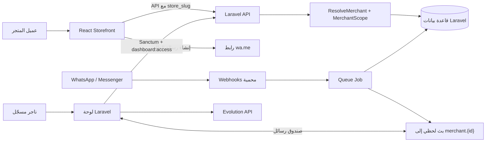

# منصة العشّاب للتجارة والمراسلات

**منصة العشّاب** هي حزمة مصدرية لمنظومة تجارة إلكترونية عربية متعددة المتاجر. تجمع المنظومة واجهة متجر React/Vite موجهة للعميل، ولوحة تاجر مبنية بقوالب Laravel، وواجهة API لخدمات الكتالوج والطلبات والعملاء، إضافة إلى صندوق رسائل موحّد يتكامل مع WhatsApp عبر Evolution API ومع خدمات Meta. يعتمد التصميم على عزل بيانات كل تاجر عبر `merchant_id` و`store_slug` حتى يعمل كل متجر ضمن نطاقه الخاص.

> **حالة الحزمة المرفوعة:** استُكملت الحزمة لاحقًا بملفات `composer.json` و`package.json` و`vite.config.js` ومجلدي `config/` و`bootstrap/` وmigrations وseeders و`public/` و`tests/`. أصبح بناء الواجهة واختباراتها متاحين وموثقين. ما يزال ملفا `artisan` و`phpunit.xml` و`composer.lock` غير متاحين ضمن المرفقات، لذلك تبقى اختبارات Laravel الخلفية وتثبيت Composer النهائيين معلّقين على استعادتها أو اعتمادها من المصدر الأصلي.

| المجال | المكوّن | المسؤولية الفعلية |
|---|---|---|
| واجهة العميل | [`src/`](src/) | متجر React يعرض المنتجات والفئات والتقييمات والمفضلة والسلة، ويحوّل الطلب إلى رسالة WhatsApp جاهزة. |
| الخلفية | [`app/`](app/) | نماذج Laravel ومتحكمات API وخدمات الطلبات والرسائل ومهام الويبهوك والأحداث. |
| التوجيه | [`routes/`](routes/) | واجهات المتجر العامة، مسارات التاجر المحمية، صفحات لوحة الإدارة، وقنوات البث الخاصة. |
| لوحة التاجر | [`resources/views/admin/`](resources/views/admin/) | إدارة المنتجات والفئات والعملاء والمراسلات والإعدادات وربط WhatsApp والتقارير. |
| تشغيل WhatsApp | [`evolution/`](evolution/) | خدمة Evolution API محليًا مع MySQL وRedis عبر Compose. |

## كيف تعمل المنظومة

يتعرف العميل إلى متجر محدد من خلال المسار `/api/stores/{store_slug}/...`. يعيّن الوسيط [`ResolveMerchant`](app/Http/Middleware/ResolveMerchant.php) التاجر، ثم يفرض [`MerchantScope`](app/Models/Scopes/MerchantScope.php) التصفية على النماذج المعزولة. بذلك تبقى المنتجات والفئات والإعدادات والطلبات والعملاء والرسائل ضمن متجر واحد، ويكون السلوك افتراضيًا مغلقًا عند غياب سياق التاجر.

| رحلة الاستخدام | التسلسل |
|---|---|
| التصفح والشراء | الواجهة تطلب الفئات والمنتجات النشطة، تحفظ السلة محليًا، تتحقق الخلفية من الأسعار والمخزون، ثم تنشئ رابط `wa.me` بالطلب بدل إنشاء دفع أو طلب قاعدة بيانات مباشر. |
| الإدارة | يسجل التاجر دخوله عبر جلسة الويب أو رمز Sanctum، ثم يدير الفئات والمنتجات والوسائط والإعدادات من لوحة الإدارة. |
| المراسلات | يصل Webhook من Meta أو Evolution، يمر عبر تحقق التوقيع/السر، ثم تنشئ مهمة صف رسالة/عميلًا معزولين للتاجر وتبث الحدث إلى قناة خاصة. |
| معالجة الطلب من الدردشة | ينشئ التاجر طلبًا من المحادثة، يضيف عناصره أو يحذفها، ويحدّث حالة الطلب؛ تتولى خدمة الطلبات تحديث المخزون ضمن معاملات قاعدة البيانات. |

## أقسام المنصة

الواجهة العامة، المعرّفة في [`src/pages/Storefront.jsx`](src/pages/Storefront.jsx)، تشمل البحث والفلاتر والفئات والمنتجات الأكثر مبيعًا وقسم العناية الخاصة والتقييمات ونموذج الاستشارة والسلة. تستخدم الواجهة `React Query` لتخزين نتائج المتجر مؤقتًا، وتدير `useCart` الكميات والمخزون والتخزين المحلي، بينما يبني [`CheckoutController`](app/Http/Controllers/Api/CheckoutController.php) رسالة WhatsApp بعد التحقق الخادمي من المنتجات المتاحة.

| القسم | نقطة البداية | التفاصيل التشغيلية |
|---|---|---|
| الكتالوج | [`ProductController`](app/Http/Controllers/Api/ProductController.php) و[`CategoryController`](app/Http/Controllers/Api/CategoryController.php) | عرض المنتجات النشطة للمتجر، وعرض كامل كتالوج التاجر إداريًا، مع صور/فيديو عبر Spatie Media Library. |
| العملاء والتفاعل | [`CustomerController`](app/Http/Controllers/Api/CustomerController.php)، [`FavoriteController`](app/Http/Controllers/Api/FavoriteController.php)، [`ReviewController`](app/Http/Controllers/Api/ReviewController.php) | Mini-CRM، المفضلة المرتبطة بزائر المتجر، ومراجعات تخضع للموافقة أو الرفض. |
| الطلبات | [`OrderService`](app/Services/OrderService.php) و[`OrderItemController`](app/Http/Controllers/Api/OrderItemController.php) | إنشاء الطلبات من الدردشة، تغيير الحالة، خصم/استعادة المخزون، وإدارة عناصر الطلب. |
| الرسائل | [`MessageService`](app/Services/MessageService.php) و[`ProcessMetaMessageJob`](app/Jobs/ProcessMetaMessageJob.php) | صندوق وارد موحّد وردود WhatsApp/Messenger وتخزين وسائط الرسائل المقبولة ضمن حد حجمي. |
| الاتصال الخارجي | [`WebhookController`](app/Http/Controllers/WebhookController.php) و[`WhatsAppConnectionController`](app/Http/Controllers/Api/WhatsAppConnectionController.php) | تحقق Webhooks، تشغيل جلسة Evolution لكل تاجر باسم `merchant_{id}`، وإدارة QR وحالة الاتصال. |

## البدء الصحيح

ابدأ بدليل [`docs/OPERATIONS.md`](docs/OPERATIONS.md) لأنه يصف الاستعادة المطلوبة قبل محاولة التشغيل. يشرح [`docs/ARCHITECTURE.md`](docs/ARCHITECTURE.md) التدفقات والعزل متعدد المتاجر، ويعرض [`docs/API.md`](docs/API.md) خريطة واجهات HTTP، أما [`docs/SECURITY.md`](docs/SECURITY.md) فيوضح معالجة الأسرار والضوابط الحالية. سجل الفحص وحدود التحقق المتاحة موجود في [`docs/REPOSITORY-AUDIT.md`](docs/REPOSITORY-AUDIT.md).

| الوثيقة | الاستخدام |
|---|---|
| [`docs/OPERATIONS.md`](docs/OPERATIONS.md) | إعداد البيئة، ترتيب الاستعادة، تشغيل العمال والبث وEvolution، وقائمة تحقق ما قبل الإنتاج. |
| [`docs/ARCHITECTURE.md`](docs/ARCHITECTURE.md) | طبقات التطبيق، نموذج العزل، الكيانات، وتسلسلات العمل. |
| [`docs/API.md`](docs/API.md) | المسارات العامة والمحمية وWebhooks وقنوات البث. |
| [`docs/SECURITY.md`](docs/SECURITY.md) | التعامل مع المفاتيح، الأسرار التي أزيلت من المصدر، ومراجعة الضوابط. |
| [`docs/REPOSITORY-AUDIT.md`](docs/REPOSITORY-AUDIT.md) | ما استُلم، ما ينقص لاستعادة التشغيل، وما تم التحقق منه. |

## الحماية وإدارة الأسرار

أزيلت كلمات المرور الصريحة التي كانت موجودة في ملفات Evolution من النسخة المرفوعة، وحُولت إلى متغيرات إلزامية في [`evolution/docker-compose.yml`](evolution/docker-compose.yml). استخدم [`.env.example`](.env.example) و[`evolution/.env.example`](evolution/.env.example) كقوالب فقط، ولا ترفع ملفات `.env` أو مفاتيح Meta أو رموز الوصول أو بيانات الإنتاج إلى Git. توثّق تفاصيل التشغيل الآمن في [`docs/SECURITY.md`](docs/SECURITY.md).

## الاختبارات والتحقق

أُعيدت اعتماديات الواجهة المتوافقة مع imports المرفقة وأضيف ملف القفل [`pnpm-lock.yaml`](pnpm-lock.yaml) وإعداد Vitest في [`vite.config.js`](vite.config.js). مرّت **10 اختبارات في 4 ملفات** تشمل السلة والإعدادات والوسائط وبطاقات المنتجات، ونجح أيضًا بناء Vite الإنتاجي. أُصلح غلاف اختبار السلة ليحاكي مزودي React Query والإشعارات المستخدمين في التطبيق الفعلي.

| نطاق التحقق | الحالة | الحد المتبقي |
|---|---|---|
| React/Vite | ناجح: `pnpm test` و`pnpm build` | يتطلب بيئة Node وpnpm المتوافقة. |
| Laravel/PHP | مؤجل | المرفقات لا تزال تفتقد `artisan` وملف PHPUnit، كما لم يتوفر مفسر PHP/Composer في بيئة الفحص. |
| قاعدة البيانات | migrations وseeders مرفوعة | لقطة SQLite المحلية لم تُرفع لأنها حالة تشغيل مولدة؛ تُستخدم migrations بدلًا منها. |

للتفاصيل وسجل الفحص المحدث، راجع [`docs/REPOSITORY-AUDIT.md`](docs/REPOSITORY-AUDIT.md).

## الترخيص والملكية

لم تتضمن المرفقات الأصلية ملف ترخيص. يجب أن يحدد مالك المشروع الترخيص وسياسة الملكية قبل أي مشاركة خارج فريقه. يبقى هذا المستودع خاصًا إلى أن يقرر المالك خلاف ذلك.
